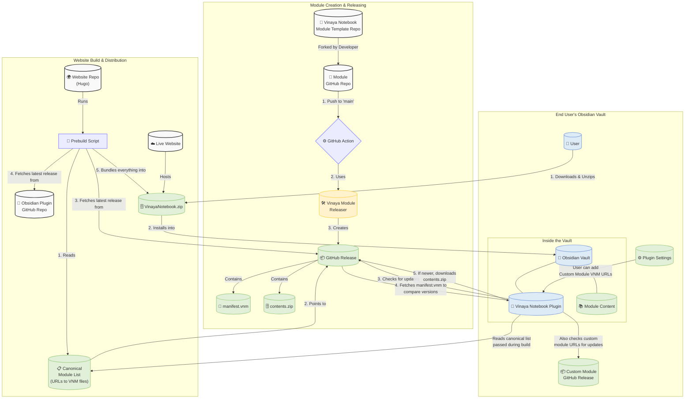
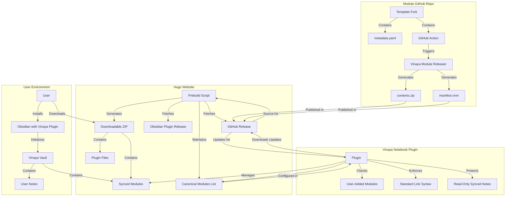
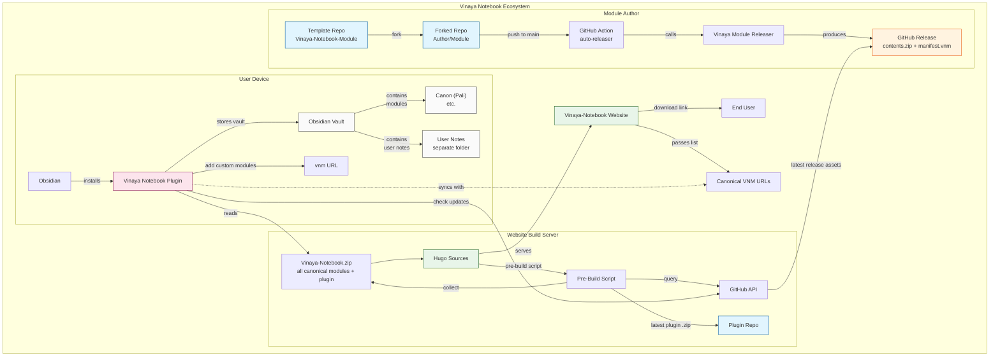

```mermaid
%% Graph by Gemini 2.5 Pro
graph TD
    subgraph "Module Creation & Releasing"
        direction LR
        TemplateRepo[("📖 Vinaya Notebook<br>Module Template Repo")] -- "Forked by Developer" --> ModuleRepo[("🔱 Module<br>GitHub Repo")]
        ModuleRepo -- "1. Push to 'main'" --> GHAction{"⚙️ GitHub Action"}
        ReleaserTool[("🛠️ Vinaya Module<br>Releaser")]
        GHAction -- "2. Uses" --> ReleaserTool
        ReleaserTool -- "3. Creates" --> GHRelease[("📦 GitHub Release")]
        GHRelease -- "Contains" --> ManifestVNM[("📄 manifest.vnm")]
        GHRelease -- "Contains" --> ContentsZip[("🗄️ contents.zip")]
    end

    subgraph "Website Build & Distribution"
        direction TB
        WebsiteRepo[("🌍 Website Repo<br>(Hugo)")]
        Prebuild["🤖 Prebuild Script"]
        CanonicalList[("📋 Canonical<br>Module List<br>(URLs to VNM files)")]
        PluginRepo[("🔌 Obsidian Plugin<br>GitHub Repo")]

        WebsiteRepo -- "Runs" --> Prebuild
        Prebuild -- "1. Reads" --> CanonicalList
        CanonicalList -- "2. Points to" --> GHRelease
        Prebuild -- "3. Fetches latest release from" --> GHRelease
        Prebuild -- "4. Fetches latest release from" --> PluginRepo
        Prebuild -- "5. Bundles everything into" --> FinalZip[("🗄️ VinayaNotebook.zip")]
        LiveSite[("☁️ Live Website")] -- "Hosts" --> FinalZip
    end

    subgraph "End User's Obsidian Vault"
        direction TB
        User[("👤 User")] -- "1. Downloads & Unzips" --> FinalZip
        Vault[("📂 Obsidian Vault")]
        FinalZip -- "2. Installs into" --> Vault
        
        subgraph "Inside the Vault"
            direction LR
            Plugin[("🔌 Vinaya Notebook Plugin")]
            ModuleContent[("📚 Module Content")]
            Vault --- Plugin & ModuleContent
        end

        Plugin -- "3. Checks for updates" --> GHRelease
        Plugin -- "Reads canonical list<br>passed during build" --> CanonicalList
        
        PluginSettings[("⚙️ Plugin Settings")]
        PluginSettings -- "User can add<br>Custom Module VNM URLs" --> Plugin
        Plugin -- "Also checks custom<br>module URLs for updates" --> CustomModule[("📦 Custom Module<br>GitHub Release")]
        GHRelease -- "4. Fetches manifest.vnm to<br>compare versions" --> Plugin
        Plugin -- "5. If newer, downloads<br>contents.zip" --> GHRelease
    end

    %% Styling
    classDef repo fill:#f9f9f9,stroke:#333,stroke-width:2px;
    classDef action fill:#ececff,stroke:#9494ff,stroke-width:2px;
    classDef tool fill:#fff2cc,stroke:#ffd966,stroke-width:2px;
    classDef data fill:#e2f0d9,stroke:#a9d18e,stroke-width:2px;
    classDef user fill:#ddebf7,stroke:#8faadc,stroke-width:2px;

    class TemplateRepo,ModuleRepo,WebsiteRepo,PluginRepo,LiveSite repo
    class GHAction,Prebuild action
    class ReleaserTool tool
    class GHRelease,ManifestVNM,ContentsZip,FinalZip,CanonicalList,ModuleContent,CustomModule,PluginSettings data
    class User,Vault,Plugin user
```

```mermaid
%% Graph by Deepseek R1
flowchart TD
    subgraph Website[Hugo Website]
        W[Prebuild Script] -->|Fetches| GR[Module GitHub Releases]
        W -->|Fetches| OP[Obsidian Plugin Release]
        W -->|Generates| Z[Downloadable ZIP]
        Z -->|Contains| MD[Module Contents]
        Z -->|Contains| OPF[Plugin Files]
        W -->|Maintains| CL[Canonical Modules List]
    end

    subgraph ModuleRepo[Module GitHub Repo]
        MR[Template Fork] -->|Contains| MY[metadata.yaml]
        MR -->|Contains| GA[GitHub Action]
        GA -->|Triggers| VMR[Vinaya Module Releaser]
        VMR -->|Generates| CZ[contents.zip]
        VMR -->|Generates| VF[manifest.vnm]
        CZ & VF -->|Published in| GR[GitHub Release]
    end

    subgraph UserEnv[User Environment]
        U[User] -->|Downloads| Z
        U -->|Installs| O[Obsidian with Vinaya Plugin]
        O -->|Initializes| V[Vinaya Vault]
        V -->|Contains| MD[Synced Modules]
        V -->|Contains| UN[User Notes]
    end

    subgraph Plugin[Vinaya Notebook Plugin]
        P[Plugin] -->|Checks| CL
        P -->|Checks| UL[User-Added Modules]
        P -->|Downloads Updates| GR
        P -->|Manages| MD
        P -->|Enforces| SL[Standard Link Syntax]
        P -->|Protects| RP[Read-Only Synced Notes]
    end

    GR -->|Source for| W
    GR -->|Updates for| P
    CL -->|Configured in| P
```

```mermaid
%% ---------------------------------------------------------
%% Vinaya Notebook – System Architecture - By Kimi
%% ---------------------------------------------------------
%% Direction: data-flow / build-flow
flowchart TD
    subgraph "Vinaya Notebook Ecosystem"
        %% ---------- 1. Module Creation ----------
        subgraph "Module Author"
            T["Template Repo<br>Vinaya-Notebook-Module"] -->|fork| FR["Forked Repo<br>Author/Module"]
            FR -->|push to main| GA["GitHub Action<br>auto-releaser"]
            GA -->|calls| VMR["Vinaya Module Releaser"]
            VMR -->|produces| REL["GitHub Release<br>contents.zip + manifest.vnm"]
        end

        %% ---------- 2. Website Build ----------
        subgraph "Website Build Server"
            HugoSite["Hugo Sources"] -->|pre-build script| PB["Pre-Build Script"]
            PB -->|query| GHAPI["GitHub API"]
            GHAPI -->|latest release assets| REL
            PB -->|latest plugin .zip| PlugRepo["Plugin Repo"]
            PB -->|collect| ZIP["Vinaya-Notebook.zip<br>all canonical modules + plugin"]
            ZIP --> HugoSite
        end

        %% ---------- 3. Website ----------
        HugoSite -->|serves| Site["Vinaya-Notebook Website"]
        Site -->|download link| User["End User"]

        %% ---------- 4. Client ----------
        subgraph "User Device"
            Obs["Obsidian"] -->|installs| VNPlug["Vinaya Notebook Plugin"]
            VNPlug -->|reads| ZIP
            VNPlug -->|stores vault| Vault["Obsidian Vault"]
            VNPlug -->|check updates| GHAPI
            VNPlug -->|add custom modules| CustomVNM["vnm URL"]

            Vault -->|contains<br>modules| Canon["Canon (Pali)<br>etc."]
            Vault -->|contains<br>user notes| UserNotes["User Notes<br>separate folder"]
        end

        %% ---------- 5. Canonical Registry ----------
        Site -->|passes list| CanonicalList["Canonical VNM URLs"]
        VNPlug -.->|syncs with| CanonicalList
    end

%% Styling
classDef repo      fill:#e1f5fe,stroke:#01579b
classDef release   fill:#fff3e0,stroke:#e65100
classDef website   fill:#e8f5e9,stroke:#1b5e20
classDef plugin    fill:#fce4ec,stroke:#880e4f
classDef storage   fill:#fafafa,stroke:#424242

class FR,PlugRepo,T repo
class REL release
class Site,HugoSite website
class VNPlug plugin
class Vault,Canon,UserNotes storage
``` 
